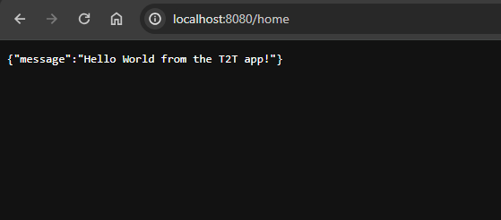

## Steps to follow to set up the app.
1. Set up a python Venv (python 3.12+)
2. Pip install requirements file
3. Navigate to src and run py/python3 main.py ( Server should be up and running )
4. Navigate to localhost:8080/docs to get the fastAPI documentation of the various endpoints created.
5. Try the signup endpoint with the data object filled ( Roles can take values 'MANAGER' and 'DEVELOPER')
6. The /signup should return an access token. Click on Authorize and save the access token ( user logged in )
7. Use the other authenticated endpoints to simulate role based access or authentication.

## Alternatively Steps to follow to build the docker image (t2tbackend_latest.tar.gz)
1. The port 8080 is exposed for this image
2. Please run the container to point to 8080
3. Run the container and try to access localhost:*_port_*/home
4. You should be able to see the following image

